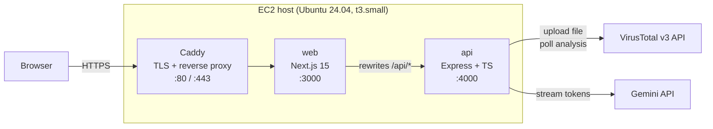

# Executive Summary

## What it is

**Webtest** is a small, production-shaped web application that accepts a file
upload (up to 32 MB), scans it through the VirusTotal public API, and streams
the verdict back to the user in real time. Once the scan reaches a terminal
state, a Gemini-powered assistant explains the result in plain language — what
engines flagged the file, what family of threat it looks like, and what the
user should do next. Tokens stream to the browser as Gemini produces them.

Nothing about the scan or conversation is persisted. All state lives in
bounded, in-memory maps that expire an hour after their last update, or when
the container restarts. The application is deliberately stateless — there is
no database, no account, no login.

## Why it exists

The project was built as a take-home engagement for CloudsineAI (see
[`../assignment.md`](../assignment.md)). The assignment required:

1. Upload a file and scan it via VirusTotal.
2. Chat with an LLM about the result.
3. Stream both scan progress and LLM output back to the browser.

Both bonus sections (Dockerisation with separate dev/prod configurations, and
a full CI/CD pipeline with auto-deploy) are implemented.

## What it demonstrates

In reviewing the codebase a reader should be able to see, among other things:

- **Streaming upload pipeline.** `busboy` → `sha256` transform → byte counter
  → outbound `form-data` stream to VirusTotal. No bytes ever touch disk on the
  server.
- **Idempotent, dedup-aware upload handling.** When VirusTotal returns `409
  Already being scanned` (a common signal when the file has been seen before),
  the API falls back to looking the file up by its SHA-256 and resuming.
- **A uniform Server-Sent Events wire contract.** Both scan progress and
  Gemini token streams use the same framing, written by a shared `SseWriter`
  and consumed by a shared `readSse` reader on the frontend.
- **Observability hooks.** Structured `pino` logs with request-ID propagation
  through outbound VT/Gemini calls; Prometheus metrics scraped from `/metrics`
  (counters, histograms, and default process metrics); request-ID is also
  echoed to the browser via `X-Request-Id`.
- **Security hygiene.** CSP, HSTS, X-Frame-Options, Referrer-Policy,
  Permissions-Policy — enforced in both Caddy (for static responses) and
  Express middleware. Rate limiting at four independent scopes. Body size
  capped at three layers (Next.js, `Content-Length` pre-check, busboy file
  limit, byte counter in-stream).
- **Production deployment.** A single-host topology behind Caddy with
  auto-HTTPS on an AWS EC2 `t3.small`, fronted by a `docker-compose` stack
  built and deployed by GitHub Actions on every push to `main`.

## System at a glance



## Service-level snapshot

| Signal | Target / Budget | Notes |
|---|---|---|
| Max upload size | **32 MB** | Enforced at four layers — VT free-tier ceiling |
| End-to-end scan latency | Typically **10–30 s** | Dominated by VirusTotal engine runtime |
| First LLM token | Target **< 2 s** | Measured as `webtest_gemini_first_token_ms` |
| Scan TTL in memory | **1 h** since last update | Bounded by a 500-entry LRU cap |
| Chat history per scan | **200 messages** | Oldest evicted in FIFO order |
| Scans per minute per IP | **5** upload / **4** VT free-tier limit | Whichever binds first |

## Repository layout

```
api/                  # Express + TypeScript backend
  src/
    routes/           # scans, scanEvents (SSE), messages (SSE), health, metrics
    services/         # virustotal, gemini, scans, messages, metrics
    lib/              # errors, hash transforms, retry, SSE writer, prompt builder
    middleware/       # error, rateLimits, requestId, securityHeaders
    config/           # security header policy
  tests/
    unit/             # transforms, virustotal, sse, promptBuilder, retry, eviction
    integration/      # upload, scanEvents, messages, rate limits, security headers

web/                  # Next.js 15 App Router frontend
  app/
    page.tsx          # dashboard with upload zone
    scans/[id]/       # scan detail + chat
  components/
    ui/               # shadcn primitives
    upload/ scans/ chat/ nav/ hero/ motion/ theme/
  lib/                # api client, SSE reader, types
  tests/
    e2e/              # Playwright smoke spec
    unit/             # MarkdownRenderer

scripts/              # bootstrap-ec2.sh, smoke.sh
docs/                 # this manual
files/                # sample uploads (benign + malware)
.github/workflows/    # ci.yml, deploy.yml
docker-compose*.yml, Caddyfile, .env.example
```

## Next steps

- Skip to the [System Overview](../10-architecture/system-overview.md) for the
  technical narrative.
- Jump to the [API Reference](../20-api-reference/README.md) if you only need
  the wire contract.
- [Reading Paths](./reading-paths.md) lays out curated sequences for each
  reviewer persona.
