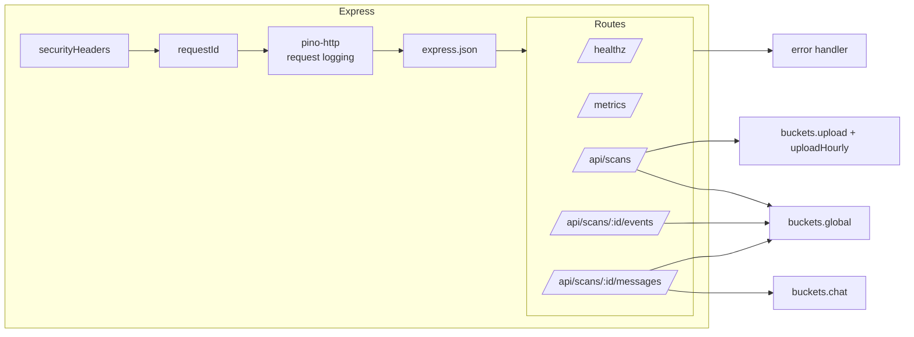
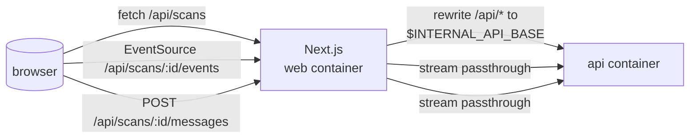

# Components (C4 L3)

One level deeper than [Context & Containers](./context-and-containers.md):
the modules inside each container and how they collaborate.

---

## The `api` container

```
api/src/
├── index.ts                 entry — listens on API_PORT
├── app.ts                   Express composition
├── config.ts                zod-parsed env → Config
├── logger.ts                pino logger w/ redaction, optional pretty
├── config/
│   └── securityHeaders.ts   header-value constants
├── middleware/
│   ├── requestId.ts         UUID → req.requestId + X-Request-Id header
│   ├── securityHeaders.ts   applies SECURITY_HEADERS + HSTS (prod)
│   ├── rateLimits.ts        express-rate-limit factory + 4 buckets
│   └── error.ts             AppError-aware JSON error shape
├── routes/
│   ├── health.ts            GET /healthz
│   ├── metrics.ts           GET /metrics  (prom-client)
│   ├── scans.ts             POST /api/scans + GET /api/scans/:id
│   ├── scanEvents.ts        GET /api/scans/:id/events   (SSE)
│   └── messages.ts          list / POST / DELETE messages (SSE on POST)
├── services/
│   ├── scans.ts             in-memory scan store w/ TTL + LRU
│   ├── messages.ts          in-memory chat per scan
│   ├── virustotal.ts        upload, hash-lookup, analysis-poll
│   ├── gemini.ts            streaming generative-ai client (factory-pluggable)
│   └── metrics.ts           prom-client registry + counters/histograms
└── lib/
    ├── errors.ts            AppError + Errors factory + ErrorCode union
    ├── hash.ts              sha256 + byteCounter Transform streams
    ├── sse.ts               SseWriter: flushHeaders, event(), close()
    ├── promptBuilder.ts     Gemini prompt shape from scan context + history
    └── retry.ts             withRetry: attempts, shouldRetry, jittered backoff
```

### Composition



`buildApp()` in `api/src/app.ts:14` wires these in order. The `trust proxy`
setting is `1` so `X-Forwarded-For` from Caddy is honoured for rate-limit
keying.

### Key modules

#### `routes/scans.ts` — Upload pipeline

The single most load-bearing file in the API. It:

1. Asserts `content-type: multipart/form-data` and `content-length` ≤
   32 MB + 1 KB (early reject before `busboy` even starts).
2. Sets a **60 s socket idle timeout** to blunt slow-drip attacks that trickle
   bytes under the size cap.
3. Pipes the multipart stream through `createSha256Transform()` and
   `createByteCounter({ max })` before forwarding it to
   `uploadToVt({ stream: passthrough })`.
4. Handles the VT `409 Already being scanned` case by falling through to
   `getFileByHash({ hash: sha256 })` and resuming with the existing analysis
   id. If VT already has a terminal analysis cached, the new scan is marked
   `completed` immediately.
5. Records `webtest_upload_total{result=accepted|rejected}` and
   `webtest_upload_duration_seconds`.

See `api/src/routes/scans.ts:20-154`.

#### `routes/scanEvents.ts` — SSE status stream

Polls `GET /analyses/:vtAnalysisId` every 2 seconds until terminal, for at
most 150 seconds. Emits:

- `event: status` on every non-terminal poll
- `event: result` on terminal success
- `event: error` on transient failure or overall timeout

Short-circuits immediately if the scan is already terminal when the client
connects. See `api/src/routes/scanEvents.ts:14-65`.

#### `routes/messages.ts` — Chat SSE

For each POST:

1. Validate `content` with zod (`min(1).max(4000)`).
2. Append a user message to the conversation via
   `services/messages.ts::appendMessage`.
3. Derive a `ScanContext` from the stored VT result, including the top 5
   detecting engines, via `scanToContext()`.
4. Build the Gemini prompt with `buildGeminiPrompt()` (system instruction +
   prior turns + new user message).
5. Stream tokens from Gemini, pushing each as `event: token` and
   accumulating into `full`.
6. On stream end, append an assistant message and emit `event: done` with
   `{ msgId, fullText }`.

An `AbortController` is bound to `req.on('close')`, so client disconnect
cancels the Gemini stream.

#### `services/virustotal.ts` — VT client

All three VT calls use the same retry policy via `withRetry`:

- **Retryable:** HTTP 429 and any 5xx.
- **Terminal:** other 4xx (notably 409 surfaces as
  `VtAlreadySubmittedError`, a separate class).

The upload buffers the incoming stream into a single `Buffer` before the
first attempt so retries can resend the same bytes — a 32 MB cap makes this
safe (see memory discussion in [design decisions](./design-decisions.md)).

#### `services/scans.ts` — Stateful-ish map

```ts
const scans = new Map<string, Scan>();
const MAX_SCANS = 500;
const TTL_MS = 60 * 60_000;       // 1 hour
const SWEEP_INTERVAL_MS = 5 * 60_000;
```

Invariants:

- `MAX_SCANS` is enforced on every `createScan()` by evicting the oldest key
  (JS `Map` preserves insertion order). Eviction cascades to the conversation
  store via `dropConversation(id)`.
- Background `setInterval(sweepExpired, 5m)` runs with `.unref()` so the
  process can exit even when this is the only live handle. Skipped under
  `NODE_ENV=test` so unit tests can drive the sweep deterministically with
  `vi.setSystemTime`.

#### `services/gemini.ts` — Swappable streaming client

The module exports `createGeminiClient` and the lower-level plumbing for
tests via `__setGeminiFactoryForTests`. Unit tests use this to swap in a
deterministic stream without mocking the entire `@google/generative-ai`
package.

#### `middleware/rateLimits.ts` — Four buckets

| Bucket | Window | Limit | Scope |
|---|---|---|---|
| `global` | 60 s | 60 req | All `/api/scans*` paths |
| `upload` | 60 s | 5 req | `POST /api/scans` only |
| `uploadHourly` | 1 h | 10 req | `POST /api/scans` only |
| `chat` | 60 s | 20 req | `POST /api/scans/:id/messages` |

Under `NODE_ENV=test` the numbers are multiplied by 1,000 so test suites do
not trigger the limiter incidentally. Each rejection increments
`webtest_rate_limit_rejected_total{bucket}` and returns the standard error
envelope with `code: "RATE_LIMITED"` and HTTP 429.

#### `lib/sse.ts` — SSE writer

Tiny adapter that sets the correct response headers
(`Content-Type: text/event-stream`, `Cache-Control: no-cache, no-transform`,
`Connection: keep-alive`, `X-Accel-Buffering: no`), flushes the headers, and
offers `event(name, data)`, `comment(text)`, and `close()` helpers.

`X-Accel-Buffering: no` is a signal to nginx/Caddy reverse proxies to turn
off response buffering for this response; Caddy honours it.

---

## The `web` container

```
web/
├── app/
│   ├── layout.tsx              Fonts, theme noflash, providers
│   ├── page.tsx                Hero + Upload + How-it-works + Colophon
│   └── scans/[id]/page.tsx     Two-column shell: main + ScanRail
├── components/
│   ├── chat/                   ChatPanel, Composer, MessageList,
│   │                           MessageBubble, MarkdownRenderer, useChatStream
│   ├── hero/HalftoneField.tsx  canvas halftone backdrop
│   ├── motion/                 ScrollProgress, ScrollReveal
│   ├── nav/TopNav.tsx
│   ├── scans/ScanRail.tsx      verdict rail (desktop) + bottom sheet (mobile)
│   ├── theme/ThemeProvider.tsx light / dark
│   ├── ui/                     shadcn primitives
│   ├── upload/
│   │   ├── UploadDropzone.tsx  drag-drop + pointer spotlight
│   │   └── ScanProgress.tsx    EventSource-driven status line
│   └── providers.tsx           TanStack QueryClient + Toaster + Theme
├── lib/
│   ├── api.ts                  apiFetch + ApiCallError
│   ├── sse.ts                  readSse AsyncGenerator
│   ├── types.ts                Scan, Message, ApiError
│   └── utils.ts                clsx + tailwind-merge
├── next.config.mjs             output: 'standalone', rewrites /api/*
├── tests/
│   ├── e2e/smoke.spec.ts       Playwright smoke
│   └── unit/MarkdownRenderer…  Vitest component test
```

### Data flow inside the web container



Next's rewrite rule passes all `/api/*` calls through to the API
container. The browser cannot address the `api` container directly — only
`web` can, and only because they share the Docker network.

### Component contracts

| Component | Props | Responsibility |
|---|---|---|
| `UploadDropzone` | — | Drag/drop / click-to-pick, 32 MB validation, POST upload, navigate to `/scans/:id` on success |
| `ScanProgress` | `scanId, initialStatus` | Opens `EventSource` to `/api/scans/:id/events`, renders a typographic "in progress" card, invalidates TanStack Query keys on `result` |
| `ScanRail` + `ScanRailStrip` | `scan: Scan` | Renders verdict, stats, per-engine breakdown. Desktop sticky rail + mobile bottom sheet |
| `ChatPanel` | `scanId` | Hosts MessageList + Composer, seeds the first assistant reply, renders error + retry UX |
| `useChatStream(scanId)` | — | `POST /messages` + SSE reader → `{ streaming, draft, error, send, stop, clearError }` |
| `MessageBubble` / `MessageList` | `messages, streamingDraft` | Markdown + code highlighting; filters out the seeded "Explain this" user turn |

### State management

The web container is deliberately minimal on state. Three stores:

1. **TanStack Query** — scan record and message list, cached for 10 s and
   invalidated at the boundary events (`result` SSE, POST `/messages` done).
2. **React component state** — streaming draft, error banner, UI toggles.
3. **URL** — the scan id is the route param.

There is no global store, no Redux, no Zustand. Server state is queried on
demand; ephemeral UI state belongs to the component that renders it.

---

## Shared concepts across both containers

### Request ID plumbing

- `api` assigns `req.requestId` in `requestId` middleware, or trusts a
  client-provided `X-Request-Id` header.
- Every log line from `pino-http` carries `reqId`.
- `virustotal.ts` and `gemini.ts` accept a `reqId` option and log it on any
  upstream error, so a VT/Gemini failure can be traced back to a single
  inbound request.
- The response header `X-Request-Id` is always echoed back to the caller so
  support traffic can reference it.

### Error envelope

Everywhere the API emits an error, it emits the same shape:

```json
{ "error": { "code": "RATE_LIMITED", "message": "Too many requests", "details": null } }
```

with an HTTP status derived from the `AppError.status`. The client maps the
`code` to user-readable copy where needed (`UploadDropzone` surfaces
`FILE_TOO_LARGE`, for example).

See [API Reference → Errors](../20-api-reference/errors.md) for the complete
code list.

### SSE framing

Both the server-side writer (`api/src/lib/sse.ts`) and the client-side
reader (`web/lib/sse.ts`) agree on a minimal framing:

```
event: token
data: {"token":"hello"}

event: done
data: {"msgId":"...","fullText":"..."}
```

Events are separated by a blank line (`\n\n`). Data fields are always JSON,
a convention the frontend reader assumes.
