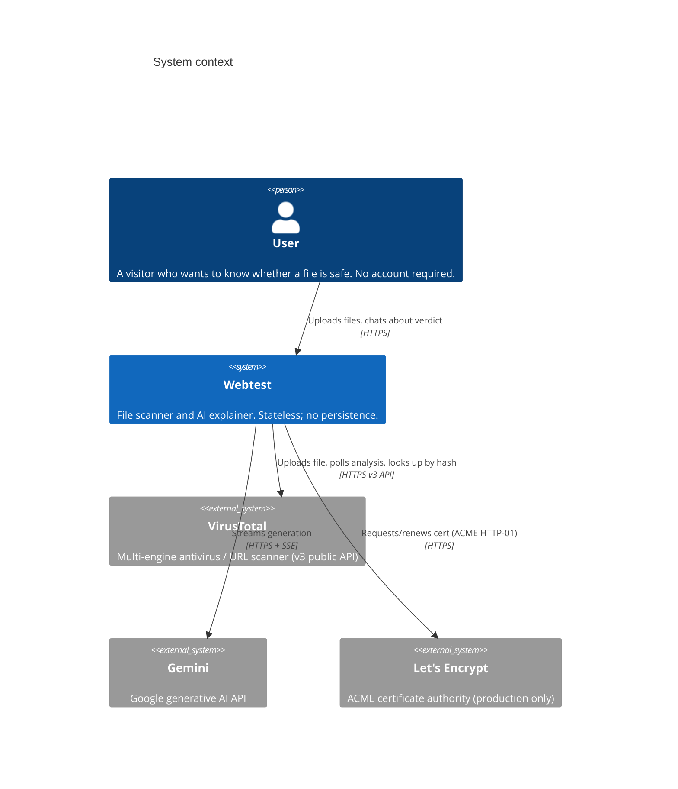
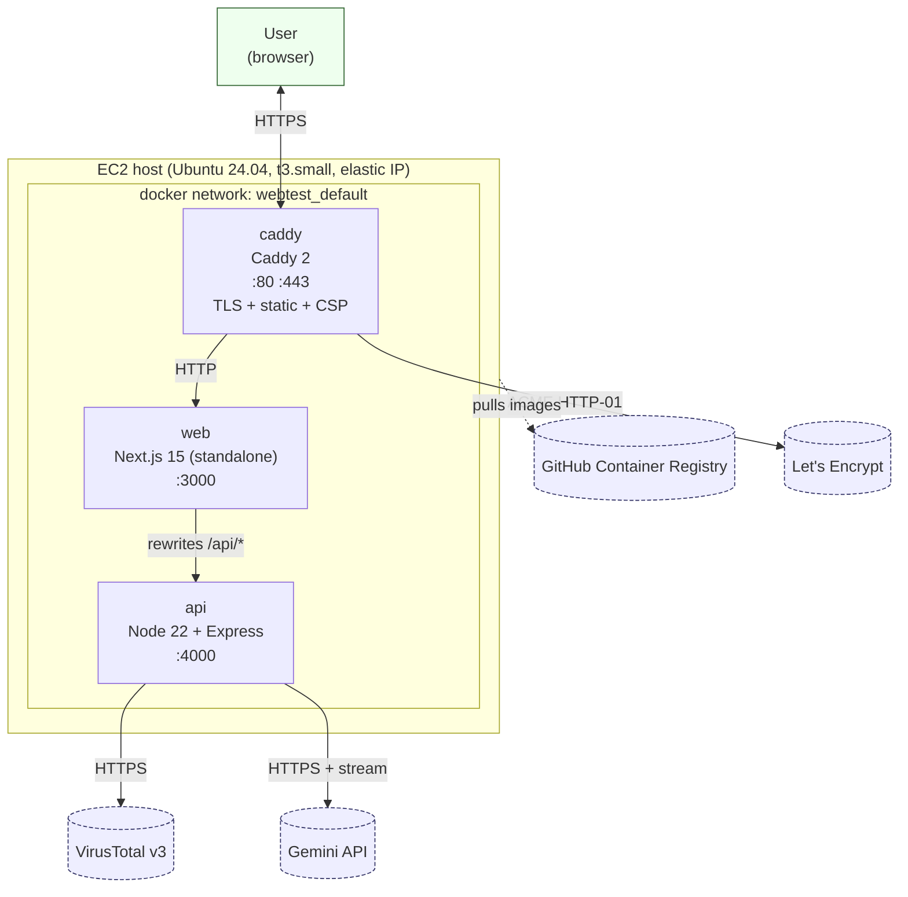
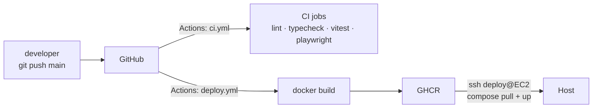
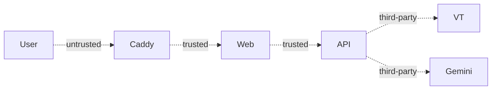

# Context & Containers (C4 L1–L2)

This document uses the [C4 model](https://c4model.com) to describe the
system at two zoom levels:

- **Level 1 — System Context.** Webtest as a single box, with the actors and
  external systems it depends on.
- **Level 2 — Containers.** The processes that make up Webtest and how they
  communicate.

For the next zoom-in (components inside each container), see
[components.md](./components.md).

---

## Level 1 — System context



### Actors

| Actor | Role | Notes |
|---|---|---|
| **User** | Uploads a file and chats about the result | Anonymous. No login or account. |

### External systems

| System | Interaction | Credential |
|---|---|---|
| **VirusTotal v3 API** | `POST /files`, `GET /files/{hash}`, `GET /analyses/{id}` | `VT_API_KEY` (header `x-apikey`) |
| **Gemini API** | `generateContentStream` via `@google/generative-ai` | `GEMINI_API_KEY` |
| **Let's Encrypt** | ACME HTTP-01 challenge for TLS certificate | `ACME_EMAIL` (contact email) |

### Out of scope at L1

Everything an operator would see: the host, the reverse proxy, the image
registry, the monitoring stack. Those appear in the container view below.

---

## Level 2 — Containers



### Container responsibilities

| Container | Technology | Exposed | Purpose |
|---|---|---|---|
| `caddy` | Caddy 2 (alpine) | `80`, `443` | TLS termination, reverse proxy to `web`, static asset caching for `/_next/static/*`, security headers |
| `web` | Node 22 + Next.js 15 standalone | `3000` (internal) | Server-renders the App Router UI, rewrites `/api/*` to the API container, ships the client bundle |
| `api` | Node 22 + Express | `4000` (internal) | Multipart upload pipeline, VirusTotal and Gemini integrations, SSE for scan status and chat, metrics, structured logs |

Only `caddy` publishes ports on the host. `web` and `api` are reachable only
on the Docker network. The dev override (`docker-compose.dev.yml`) additionally
publishes `web:3000` and `api:4000` so Playwright can hit the web container
directly without TLS.

### Inter-container calls

| From | To | Protocol | Notes |
|---|---|---|---|
| `caddy` | `web` | HTTP / `reverse_proxy web:3000` | Streaming-friendly (buffering off for `/_next/static/*`) |
| `web` | `api` | HTTP / Next.js rewrites | `${INTERNAL_API_BASE}` (default `http://api:4000`) |
| `api` | VirusTotal | HTTPS / `undici` `fetch` | Streams upload body via `form-data` → `PassThrough` |
| `api` | Gemini | HTTPS / `@google/generative-ai` | Uses `generateContentStream` for SSE-style reads |

### Healthchecks

```
api    HEALTHCHECK GET /healthz           every 10s, 3s timeout, 20s start-period
web    HEALTHCHECK GET /                  every 10s, 3s timeout, 20s start-period
caddy  (none — Caddy fronts healthchecks of its upstreams)
```

See `api/Dockerfile:26-27` and `web/Dockerfile:31-32`.

### Build & deploy path



- Every PR and push runs `ci.yml` (lint, typecheck, unit + integration tests
  in both workspaces, Playwright e2e over docker compose).
- Every push to `main` also runs `deploy.yml`: images are built via
  `docker/build-push-action`, tagged with the commit SHA and `latest`, pushed
  to GHCR, then pulled on the host via SSH as the `deploy` user.

See [CI/CD](../40-operations/ci-cd.md) for the full pipeline description.

### Dev vs prod composition

| Aspect | Dev (`docker-compose.yml` + `.dev.yml`) | Prod (`docker-compose.yml` + `.prod.yml`) |
|---|---|---|
| Image source | Locally built | Pulled from GHCR |
| Port exposure | `web:3000`, `api:4000` additionally published | Only `caddy:80/443` |
| TLS | Caddy serves plain HTTP on :80 for `localhost` | Caddy serves HTTPS for `${PUBLIC_HOSTNAME}` |
| `NODE_ENV` | Defaults to `production` in the base file — override via `.env` if you want development logging | Always `production` |

## Trust boundaries



The perimeter is the public hostname. Everything inside the EC2 Docker
network is trusted; the container-to-container hops do not re-authenticate.
Traffic to VirusTotal and Gemini is authenticated with per-tenant API keys
held in the host's `.env`; both are redacted from logs by the `pino` redact
list.

## Failure domains

| Failure | Blast radius | Detection | Mitigation |
|---|---|---|---|
| VirusTotal 5xx or rate-limit | Individual scan degrades | `webtest_vt_request_total{outcome=fail}` + logs | Exponential retry (3 attempts, 500ms base, jittered) |
| Gemini stream error | Single chat turn fails, user sees "Retry" | `event: error` SSE frame + pino `warn` | Retry button on the UI; conversation history preserved |
| Scan TTL reached mid-chat | Reader hits "Scan not found" | 404 from `/api/scans/:id` | Start a new scan (clarified in UI copy) |
| Host reboot / container restart | All scans wiped | `docker compose ps`, `/metrics` resets | Expected by design; the app is a live analysis tool, not a history service |
| Caddy cert renewal failure | HTTPS certificate expires | Browser warning; Caddy logs | Caddy auto-renews from 30 days out; manual `caddy reload` as last resort |
