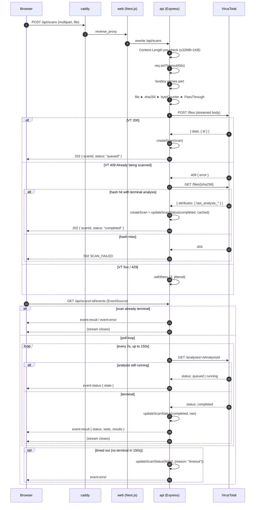
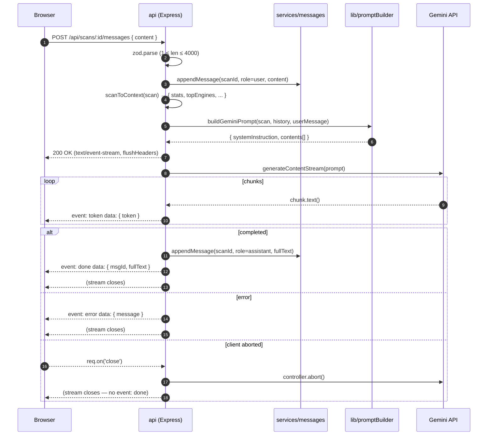
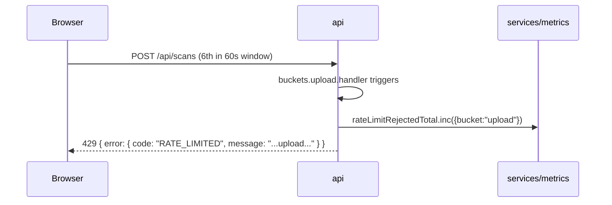
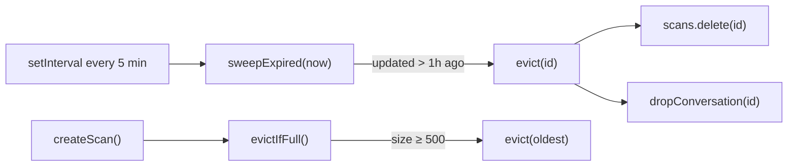

# Data Flow

Sequence diagrams and annotations for the two user-visible flows: the upload
and the chat.

---

## Flow 1 — Upload and scan to verdict

### Notes per step

- **Pre-check (step 3).** Reject before `busboy` allocates. If the content
  length exceeds the cap by more than 1 KB, the request is drained briefly so
  the 413 response can reach the client before the socket is closed.
- **60 s socket timeout (step 4).** Protects against slow-drip uploads that
  trickle bytes indefinitely to stay under the size cap. If no progress
  occurs for 60 s, the request is destroyed.
- **Stream topology (step 6).** `req → busboy → file stream → sha256 → counter
  → PassThrough → undici fetch body`. The hash is finalised only after the
  counter emits `end`, guaranteeing we hash every byte that reached VT and
  nothing else.
- **VT retry (step 15).** `withRetry` retries on HTTP 429 and 5xx with a
  jittered exponential backoff starting at 500 ms. 409 is excluded — it is a
  *signal*, handled explicitly in the caller.
- **Cached-terminal short-circuit (step 10).** If VT's hash lookup returns an
  analysis that is already terminal (e.g. the file has been seen recently),
  the scan is stored as `completed` immediately and the SSE poll loop does
  not run.
- **Client-side poll behaviour.** The browser's `useQuery` also polls
  `GET /api/scans/:id` every 3 s while the status is non-terminal
  (`web/app/scans/[id]/page.tsx:19-22`), providing a fallback path for the
  UI should the SSE stream drop.
- **Hard cap at 150 s.** If VT has not reached a terminal state in that
  window the scan is marked `failed` and a final `event: error` is emitted.
  VT typically completes in 10–30 s; the 150 s cap exists for the long tail.

---

## Flow 2 — Chat turn with streaming explanation

### Notes per step

- **Prompt shape.** The system instruction includes the file's name, SHA-256,
  status, aggregated detection counts, and up to 5 detecting engine names.
  See `api/src/lib/promptBuilder.ts:26-37`.
- **History encoding.** Prior turns are encoded as Gemini `{ role, parts }`
  pairs — user turns map to `role: "user"`, assistant turns to `role:
  "model"`. System message entries (if any) are filtered out before the
  prompt is built.
- **First-token telemetry.** The first yielded token triggers
  `webtest_gemini_first_token_ms.observe(now - streamStart)`. This is the
  most useful latency signal because the full stream length is variable
  based on model output.
- **Abort semantics.** `req.on('close', () => controller.abort())` wires the
  client disconnect to `AbortController.abort()`, which is observed by the
  `for await (...)` loop at the top of each iteration. No `event: done` is
  emitted on abort.
- **Chat history cap.** `appendMessage` shifts the oldest entries once the
  conversation exceeds 200 messages, so the prompt does not grow without
  bound. Note: this is a simple hard cap, not summarisation — see the
  known-limitations section of the top-level README.

---

## Flow 3 — Rate-limit rejection

Headers on a 429 response include the draft-7 RateLimit family
(`RateLimit-Policy`, `RateLimit-Limit`, `RateLimit-Remaining`, `RateLimit-Reset`),
emitted by `express-rate-limit`. Legacy headers are off.

---

## Flow 4 — Scan eviction

The sweep runs with `.unref()` so the node process can exit cleanly in dev
or during container shutdown; see [System Overview](./system-overview.md)
for the state-model rationale.
