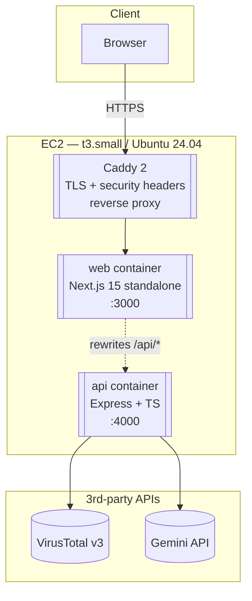
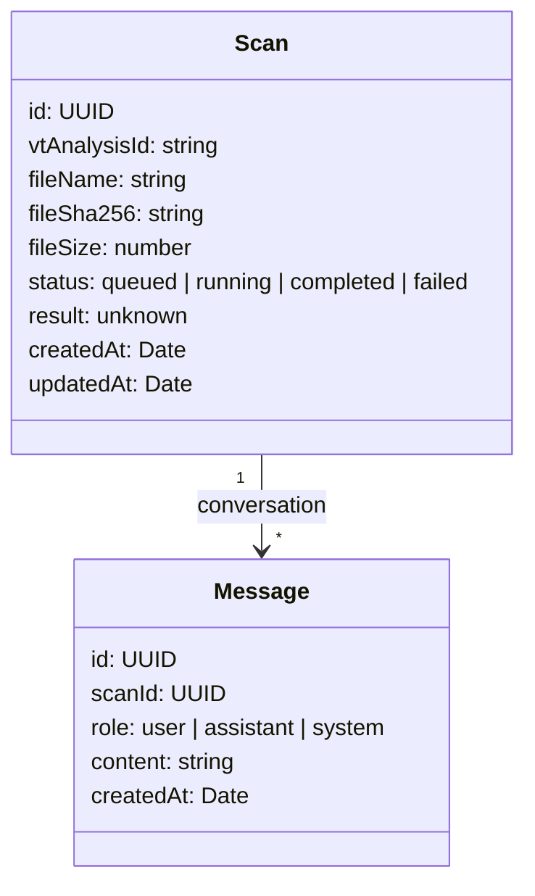

# System Overview

## Purpose

Webtest scans a file through VirusTotal and explains the result through a
Gemini-powered assistant. Both actions stream their output to the browser.
Nothing about the file or the conversation is persisted.

The system is designed to be:

- **Stateless** — no database, no session, no login; state is in bounded
  in-memory maps that vanish with a restart.
- **Streaming-native** — both the upload-to-VT path and the assistant's reply
  are streamed end-to-end. The reader sees progress as soon as the server
  sees it.
- **Single-host deployable** — one EC2 instance, one `docker compose` stack,
  one Caddy config. Zero orchestration.
- **Observable** — structured logs with request-ID propagation, Prometheus
  metrics on `/metrics`, and a dedicated smoke script for post-deploy
  invariants.

## Headline numbers

| Metric | Value |
|---|---|
| Containers | 3 (`caddy`, `web`, `api`) |
| Backend languages | TypeScript (Node 22) |
| Frontend stack | Next.js 15 (App Router), React 19, Tailwind, TanStack Query |
| Proxy | Caddy 2 with auto-HTTPS via Let's Encrypt |
| Max upload | 32 MB (VT free-tier ceiling) |
| Max scans in memory | 500 |
| Scan TTL | 1 hour since last update |
| Chat history cap | 200 messages per scan |
| Test suites | Vitest (unit + integration), Playwright (e2e), shell (smoke) |

## Topology

Caddy owns port 80 and 443 on the public interface. `web` and `api` are
reachable only from inside the Docker network. The public hostname is
driven by the `PUBLIC_HOSTNAME` env var and Caddy acquires a Let's Encrypt
certificate for it on first boot.

## Runtime responsibilities

| Container | Responsibility | Key code |
|---|---|---|
| `caddy` | TLS, reverse proxy to `web`, security headers, static cache | `Caddyfile` |
| `web` | Server-render and ship the UI; rewrite `/api/*` to the API container | `web/app/**`, `web/next.config.mjs:19-23` |
| `api` | Upload pipeline, VT and Gemini integrations, SSE for both, metrics and logging | `api/src/app.ts`, `api/src/routes/**`, `api/src/services/**` |

## The two golden flows

### 1 · Upload → verdict

1. The browser POSTs a multipart form to `/api/scans`.
2. `busboy` parses the request in the API container. The file stream passes
   through a SHA-256 transform and a byte counter before being piped into an
   outbound `form-data` body sent to `POST https://www.virustotal.com/api/v3/files`.
3. The API stores a `Scan` record (`queued` status) in the in-memory map and
   responds `202 Accepted` with the scan id.
4. The browser opens `GET /api/scans/:id/events` (EventSource). The API polls
   `GET /analyses/:analysisId` every 2 s, relays the status over SSE, and
   closes the stream when the analysis reaches a terminal state.

If VT replies `409` (file is already being scanned), the API falls back to
`GET /files/:sha256` and resumes with the existing analysis. If the cached
analysis is already terminal, the scan is marked `completed` immediately and
the SSE stream short-circuits.

### 2 · Verdict → assistant reply

1. The browser hits `POST /api/scans/:id/messages` with `{ content }`.
2. The API appends a user message, builds a Gemini prompt with a
   system-instruction containing the scan context, and opens an SSE response
   with `content-type: text/event-stream`.
3. The API streams Gemini tokens into `event: token` SSE frames until the
   model finishes. On completion it appends an assistant message to the
   conversation and emits `event: done` with the full text.

The client stitches the streamed tokens into a visible draft, and replaces
the draft with the finalised message when `done` arrives.

## State model (one picture)

Both are held in `Map` instances in the `api` process. The scan store runs a
background sweeper (5-minute interval) that evicts entries older than 1 hour,
and a 500-entry LRU cap; evictions cascade to the conversation store via
`dropConversation(id)`.

## What is explicitly not here

- **No database.** Not Postgres, not Redis, not SQLite. The in-memory map is
  the store. Restart = clean slate.
- **No authentication.** Every scan is public to anyone holding its UUID. The
  UUIDs are unguessable in practice, but the system is not a secret-keeping
  service.
- **No file persistence.** Bytes pass through the process and are not
  written to disk on the server side.
- **No queue.** VT polling runs in the same request that holds the SSE
  connection open. If the client disconnects, the poll stops.

## Cross-cutting concerns

- **Error handling.** Errors are thrown as `AppError` instances with a stable
  `code` and HTTP `status`. A single error-handler middleware shapes them
  into the wire envelope `{ error: { code, message, details? } }`.
- **Observability.** Every request receives a UUIDv4 from the `requestId`
  middleware, echoed back as `X-Request-Id`, attached to every log line, and
  forwarded through to VT/Gemini as the `reqId` option.
- **Rate limiting.** Four independent buckets from `express-rate-limit`:
  `global` (60/min), `upload` (5/min), `uploadHourly` (10/hour), `chat`
  (20/min). Each rejection increments `webtest_rate_limit_rejected_total{bucket}`.
- **Security headers.** Dual enforcement — Caddy sets them for HTML/static
  responses; the `securityHeaders` middleware sets them for API responses.
  CSP is set by Caddy only.
