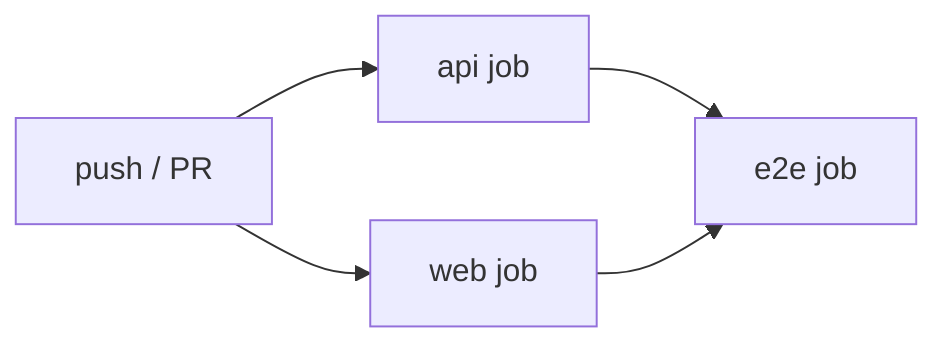

# CI/CD

Two GitHub Actions workflows: `ci.yml` (verification on PR + push) and
`deploy.yml` (build and deploy on push to `main`).

## `ci.yml` — verification pipeline

Triggered on every pull request and every push to `main`. Three jobs
run in parallel where possible; `e2e` depends on both `api` and `web`.

### `api` job

1. `actions/setup-node@v4` with `node-version: '22'` and npm cache.
2. `npm ci` inside `api/`.
3. `npm run lint` — ESLint with the TypeScript plugin.
4. `npm run typecheck` — `tsc --noEmit`.
5. `npm test` — Vitest, `NODE_ENV=test`.
6. `npm run test:cov` — coverage gate. Thresholds defined in
   `vitest.config.ts`; the job fails if any are unmet.

### `web` job

1. `npm ci` inside `web/`.
2. `npm run lint` — Next's ESLint config.
3. `npm run typecheck`.
4. `npm run build` — `next build`. Catches SSR / build-time failures.

### `e2e` job

Runs Playwright against a real docker compose stack. Skipped on PRs
from forks (no secrets) and on any run where `VT_API_KEY` /
`GEMINI_API_KEY` aren't configured.

1. Check out the repo, install Node 22.
2. Detect whether required secrets exist. If not, emit a workflow
   warning and skip the subsequent steps.
3. Materialise `.env` from `.env.example`, filling in secrets via
   `sed`.
4. `docker compose -f docker-compose.yml -f docker-compose.dev.yml up
   -d --build`.
5. Poll `http://localhost:3000` up to 60 × 2 s until healthy.
6. Install Playwright chromium with system deps.
7. `npx playwright test` with `E2E_BASE_URL=http://localhost:3000`.
8. On failure: upload `playwright-report` and `test-results` as build
   artifacts; dump `docker compose logs`.
9. Always tear down: `docker compose down -v`.

Concurrency is keyed on `ci-${{ github.ref }}` with
`cancel-in-progress: true`, so a new push cancels in-flight runs on the
same branch.

See `.github/workflows/ci.yml`.

## `deploy.yml` — build + deploy pipeline

Triggered on push to `main` and via manual `workflow_dispatch` (for
rollback). Concurrency is keyed on `deploy-${{ github.ref }}` with
`cancel-in-progress: false` — a new deploy waits for the prior one to
finish rather than cancelling it.

### `build` job

1. Check out the repo.
2. Normalise the owner slug to lowercase (GHCR requires lowercase).
3. Set up Docker Buildx.
4. `docker/login-action@v3` against `ghcr.io` using the workflow's
   `GITHUB_TOKEN`.
5. For each of `api` and `web`:
   - `docker/build-push-action@v6`
   - `push: true`
   - Tags: `:<github.sha>` and `:latest`
   - Caches: `type=gha,scope=api|web`

### `deploy` job

Depends on `build`. Runs `appleboy/ssh-action` against `EC2_HOST` as
`EC2_USER` with the private key in `EC2_SSH_KEY`. The script:

1. `cd /opt/webtest`.
2. `docker login ghcr.io` with `GHCR_TOKEN` via stdin.
3. Export `API_IMAGE` and `WEB_IMAGE` with the current commit SHA.
4. `docker compose -f docker-compose.yml -f docker-compose.prod.yml
   pull`.
5. `docker compose ... up -d`.
6. `docker image prune -f` — reclaim disk from previous builds.

Failure in any step leaves the prior-running containers untouched
(images are pulled first, then `up -d` replaces only the containers
whose image digests changed).

See `.github/workflows/deploy.yml`.

## Required secrets

| Secret | Used by | Purpose |
|---|---|---|
| `EC2_HOST` | `deploy.yml` | EIP or DNS name of the production host |
| `EC2_USER` | `deploy.yml` | `deploy` |
| `EC2_SSH_KEY` | `deploy.yml` | Private half of the deploy key |
| `GHCR_TOKEN` | `deploy.yml` | PAT with `read:packages` for the EC2-side `docker login` |
| `VT_API_KEY` | `ci.yml` (e2e) | Real VirusTotal key for the end-to-end scan assertion |
| `GEMINI_API_KEY` | `ci.yml` (e2e) | Real Gemini key for the chat stream assertion |

Production app secrets (`VT_API_KEY`, `GEMINI_API_KEY` used at
**runtime** by the API container) live only in `/opt/webtest/.env` on
the host — they never traverse GHA for deployment purposes.

## Release cadence

- Changes land via PR. PRs are gated by the full `ci.yml` suite.
- Merging to `main` automatically triggers `deploy.yml`.
- No tags, no release branches, no change-freeze windows. The cadence
  is "every merge ships."

## Rollback procedure

1. **Via GitHub UI:** navigate to the last-known-good `deploy.yml`
   run. Click **Run workflow** on the same ref; the deploy script
   repins to that SHA's images.
2. **Via SSH:** see [Deployment → Rollback](./deployment.md#rollback).

## Extending the pipeline

If you add a workflow, please:

- Set `concurrency` with a meaningful group — pipelines should not
  pile up on the same ref.
- Gate secrets with a check step so external PRs don't fail in a
  confusing way when the secret is missing.
- Upload artifacts on failure for anything involving a browser.
- Add the new workflow to this document.
