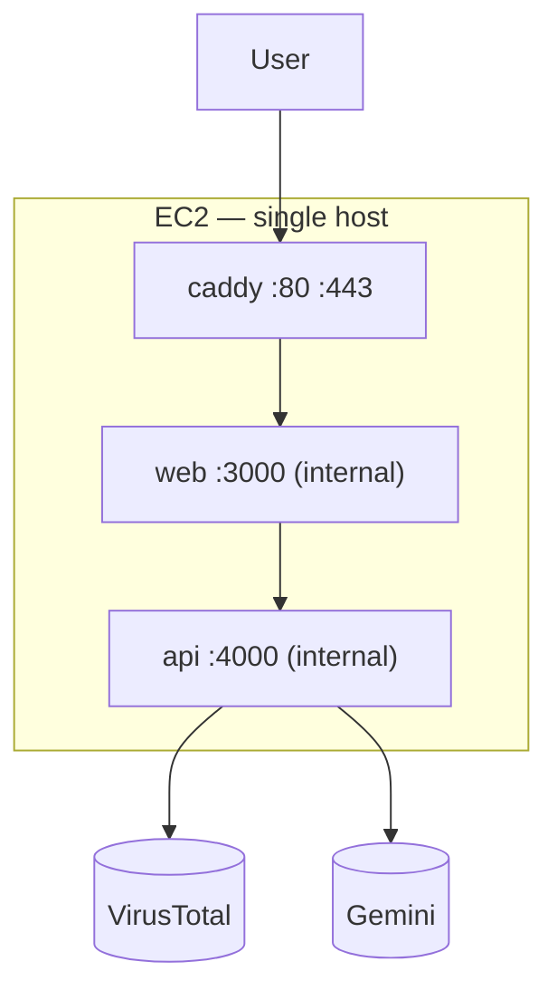
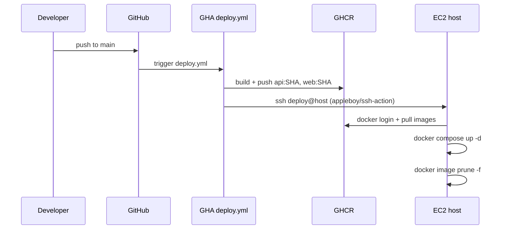

# Deployment

## Target topology

Production runs on a single AWS EC2 instance:

- **Instance:** `t3.small` (2 vCPU, 2 GiB RAM).
- **OS:** Ubuntu 24.04 LTS.
- **Networking:** Elastic IP, security group open to TCP 22 (restricted
  to the operator's IP), 80, 443.
- **Storage:** default gp3 root volume. No EBS data volume is
  attached — the app does not persist state.

Three containers compose the application:



Only Caddy publishes ports on the host interface. `web` and `api` are
reachable only from within the `webtest_default` Docker network.

## Compose file topology

Two files are always applied; a third is overlaid for dev:

| File | Purpose | Used when |
|---|---|---|
| `docker-compose.yml` | Base services (`api`, `web`, `caddy`) with runtime env and volumes | Always |
| `docker-compose.prod.yml` | Overrides `build:` to pull `ghcr.io/<owner>/<repo>-{api,web}:<tag>` | Prod deploy |
| `docker-compose.dev.yml` | Publishes `web:3000` and `api:4000` to host ports | Local dev / e2e |

Typical production invocation:

```bash
export API_IMAGE=ghcr.io/<owner>/<repo>-api:<sha>
export WEB_IMAGE=ghcr.io/<owner>/<repo>-web:<sha>
docker compose -f docker-compose.yml -f docker-compose.prod.yml up -d
```

## Images

Images are built in GitHub Actions (see [CI/CD](./ci-cd.md)) and pushed
to GitHub Container Registry. Tags:

| Tag | When pushed |
|---|---|
| `:<sha>` | Every successful build on `main` |
| `:latest` | Every successful build on `main` |

The `:<sha>` tag is what the deploy script pins; `:latest` is a
convenience for debugging on the host.

### Multi-stage layout

Both Dockerfiles use a three-stage build:

1. **`deps`** — `npm ci --omit=dev` for the runtime; cacheable across
   source changes.
2. **`build`** — full `npm ci` then compile (`tsc` for api,
   `next build` for web).
3. **`runtime`** — Alpine-based node 22, a non-root `app` user, copies
   only the compiled output and production node_modules.

Healthcheck directives are set in the runtime stage so `docker compose
ps` reflects service readiness. See `api/Dockerfile:26-27` and
`web/Dockerfile:31-32`.

## Caddy

Caddy fronts the stack at `:80` and `:443`, acquiring Let's Encrypt
certificates automatically at boot for `${PUBLIC_HOSTNAME}`.

Key behaviours in `Caddyfile`:

- **Dual site blocks:** one for the production hostname
  (`{$PUBLIC_HOSTNAME}`) and a `:80` catch-all for local dev.
- **Shared-headers snippet:** sets `X-Content-Type-Options`,
  `X-Frame-Options`, `Referrer-Policy`, `Permissions-Policy`, and
  strips `Server` / `X-Powered-By`.
- **HTML CSP snippet:** applies a strict Content Security Policy to
  HTML responses only.
- **HSTS on production only:** `max-age=31536000; includeSubDomains;
  preload` — never emitted in dev.
- **Static caching:** `/_next/static/*` receives
  `Cache-Control: public, max-age=31536000, immutable`.
- **gzip + zstd** enabled on production responses.

`/metrics` is deliberately **not** proxied — see ADR-0011 in
[Design Decisions](../10-architecture/design-decisions.md#adr-0011-metrics-is-not-publicly-routed).

## One-time host bootstrap

Covered in `scripts/bootstrap-ec2.sh`. The script:

1. Installs Docker Engine + Compose plugin.
2. Enables UFW with 22 / 80 / 443 open.
3. Creates a `deploy` user in the `docker` group with
   `/home/deploy/.ssh/authorized_keys`.
4. Creates `/opt/webtest/` owned by `deploy`.

After the script runs, the operator must:

1. Paste the GitHub Actions deploy-user public key into
   `/home/deploy/.ssh/authorized_keys`.
2. Copy `docker-compose.yml`, `docker-compose.prod.yml`, `Caddyfile`,
   and a filled-in `.env` into `/opt/webtest/`.
3. `chmod 600 /opt/webtest/.env`.

See [`docs/deployment.md`](../../deployment.md) for the step-by-step
bootstrap walkthrough, including DNS setup.

## Deploy flow (happy path)



`appleboy/ssh-action` connects as `deploy` and runs a short bash
payload — `docker login`, `compose pull`, `compose up -d`, prune
dangling images. See `.github/workflows/deploy.yml:70-95`.

## Rollback

The deploy workflow's `workflow_dispatch` trigger re-runs an older
commit SHA by dispatching against the desired ref. The deploy script
pins to `${{ github.sha }}` of the run, so re-running a prior run
restores the exact prior image set.

For a hot rollback bypassing GHA, SSH to the host and override the
image env vars before `compose up`:

```bash
ssh deploy@<host>
cd /opt/webtest
export API_IMAGE=ghcr.io/<owner>/<repo>-api:<old-sha>
export WEB_IMAGE=ghcr.io/<owner>/<repo>-web:<old-sha>
docker compose -f docker-compose.yml -f docker-compose.prod.yml up -d
```

Because every state in the system is ephemeral, a rollback is zero-risk
in the data-loss sense. Scans in flight will be cancelled.

## Post-deploy verification

Run the smoke script from anywhere reachable to the host:

```bash
bash scripts/smoke.sh https://<public-hostname>
```

It asserts:

1. `/healthz` returns `{"ok":true}`.
2. Security headers (`X-Content-Type-Options`, `X-Frame-Options`,
   `Referrer-Policy`) are present on `/`.
3. An oversized upload (33 MB Content-Length) is rejected with 413.
4. `/metrics` is **not** publicly reachable.

The script exits non-zero on any failure, so it can be wired into
`deploy.yml` as a gate or left as a manual check.

See [Runbooks](./runbooks.md) for post-deploy triage procedures.

## Capacity

| Resource | Headroom |
|---|---|
| CPU | 2 vCPU idle at < 5 %. Upload handling is bandwidth-bound, not CPU-bound |
| RAM | 2 GiB — measured steady-state < 400 MB across all three containers |
| Network | Dominated by upload size × concurrency. Capped to 5 uploads/min by the rate limit |
| Disk | 8 GiB gp3 — images + logs fit comfortably; no persistent data |

Scaling vertically to `t3.medium` or `t3.large` would give margin for
higher traffic but is unnecessary for the expected load.

Scaling horizontally would require a shared store (scans and chat must
survive across replicas). Out of scope for the current product.
