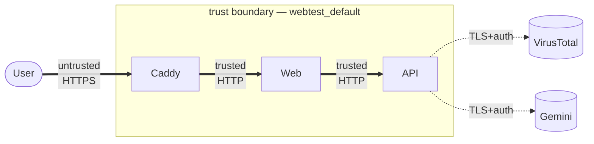

# Security

## Trust model

The public perimeter is the public hostname — everything served by
Caddy on `:443`. Inside that perimeter the Docker network is treated
as trusted; the container-to-container hops do not re-authenticate.
Traffic to VirusTotal and Gemini is authenticated with per-tenant API
keys held in `/opt/webtest/.env` on the host.



## Controls in force

### Network

- **Public ports:** only 22, 80, 443 (enforced by AWS security group
  *and* the host's UFW).
- **SSH:** restricted to the operator's IP at the security group level;
  `deploy` user has `authorized_keys` only.
- **TLS:** Caddy terminates TLS with certificates from Let's Encrypt
  via ACME HTTP-01. Private keys live in the `caddy_data` volume.

### Transport / response headers

Applied both at the edge (Caddy) and in Express middleware:

| Header | Value | Notes |
|---|---|---|
| `X-Content-Type-Options` | `nosniff` | MIME sniff protection |
| `X-Frame-Options` | `DENY` | Clickjacking |
| `Referrer-Policy` | `strict-origin-when-cross-origin` | |
| `Permissions-Policy` | `camera=(), microphone=(), geolocation=()` | Forbids sensor APIs |
| `Strict-Transport-Security` | `max-age=31536000; includeSubDomains; preload` | Production only |
| `Content-Security-Policy` | *see below* | Caddy, HTML responses only |

CSP (from `Caddyfile:17-20`):

```
default-src 'self';
script-src 'self' 'unsafe-inline';
style-src 'self' 'unsafe-inline';
img-src 'self' data:;
font-src 'self' data:;
connect-src 'self';
frame-ancestors 'none';
base-uri 'self';
form-action 'self';
```

`'unsafe-inline'` on scripts is required by Next's inline hydration
snippets; tightening this to a nonce-based policy is a known follow-up.

### Upload hardening

Four-layer size enforcement (see
[Data Flow](../10-architecture/data-flow.md#flow-1--upload-and-scan-to-verdict)):

1. Browser-side check in `UploadDropzone` (user-friendly rejection).
2. Next.js pipeline limit: `middlewareClientMaxBodySize: '32mb'`.
3. API `Content-Length` pre-check (`> 32 MB + 1 KB` → 413).
4. Streaming byte counter in `api/src/lib/hash.ts`.

Slow-drip protection: the API calls `req.setTimeout(60_000, ...)` on
every upload. No progress for 60 s → socket destroyed.

### Rate limiting

Four buckets from `express-rate-limit`. See
[Rate Limits](../20-api-reference/rate-limits.md) for the table. Each
rejection is counted in `webtest_rate_limit_rejected_total`.

### Secret handling

- API keys live in `/opt/webtest/.env` on the host, owned by `deploy`
  with `0600` perms. Docker Compose reads them via `env_file`
  semantics (they are injected into the container environment).
- The pino `redact` list masks authorization / cookie request headers
  and any object field named `password` / `password_hash`.
- GitHub Actions secrets are scoped to `deploy.yml` (EC2 creds, GHCR
  token) and `ci.yml` (VT and Gemini keys for e2e only). They never
  appear in logs because GitHub masks them automatically.

### Non-root containers

Both `api` and `web` images run as a non-root `app:app` user created
at image-build time. The only port-privileged container is Caddy, and
it runs as root solely to bind ports 80 / 443 — Caddy drops capabilities
after binding.

### Content-type enforcement

Uploads without `multipart/form-data` are rejected at
`api/src/routes/scans.ts:21-23` with `VALIDATION_FAILED`. JSON bodies
are parsed with a `100 KB` limit — anything larger rejects before
reaching a route handler.

## Threat model

Using STRIDE, applied to the live surface:

### Spoofing

- **User → app.** No authentication; the scan id is the capability.
  UUIDv4s are unguessable in practice (2^122 space), but:
  - *Risk:* anyone with the URL has full access to the scan and
    conversation.
  - *Mitigation:* scans expire in 1 hour; nothing sensitive is
    persisted beyond that; URL is not shared by design.
- **App → VT / Gemini.** TLS + per-tenant API key. Impersonation would
  require exfiltrating the key from the host.

### Tampering

- **Request tampering** is bounded by the rate limiter and the upload
  size caps. No endpoint mutates state other than "create scan" and
  "append chat turn".
- **Docker image tampering** is the risk surface. Mitigated by:
  - GHCR uses the workflow's `GITHUB_TOKEN` for publication, so only
    the repository's own Actions can push.
  - Pulls on the host require `GHCR_TOKEN` (a PAT with
    `read:packages` scope). Lives only in `deploy.yml` secrets.

### Repudiation

- All actions are logged with a `reqId`. The scan store contains the
  `fileSha256` and timestamps, so a minimal audit trail exists within
  the TTL window.
- No user identity → no per-user audit, by design.

### Information disclosure

- **Engine results.** VT results are public by definition (VT's
  community database is world-readable). No concern.
- **Chat content.** Lives in memory only, evicted in 1 hour. A
  process snapshot or memory dump would expose it; hardened deployments
  should set `ulimit -c 0` on the container.
- **Secrets in logs.** Redaction list is conservative. The pino
  logger is unlikely to stringify user-provided bodies.
- **/metrics.** Not publicly routed. See ADR-0011.

### Denial of service

- **Upload flood.** 5/min per IP, 10/hour per IP.
- **Chat flood.** 20/min per IP.
- **CPU from giant markdown.** Chat content is capped at 4,000 chars.
  Assistant replies are bounded by Gemini's output length.
- **Long-lived SSE connections.** Scan events close after at most
  150 s. Chat streams close when Gemini is done. Client disconnect is
  immediately honoured.
- **Memory.** Scans capped at 500, conversations at 200 messages.

### Elevation of privilege

- No admin endpoints. No role system. There is nothing to elevate
  into.

## What is explicitly out of scope

- **Malware in uploaded files** — scanning is the product's purpose.
  The server never executes the uploaded bytes; they are streamed
  through transforms that only read length and hash.
- **Private content moderation of chat** — Gemini's safety filters run
  upstream; we do not further filter user prompts or model output.
- **Cross-tenant isolation** — the app is single-tenant. Every user
  effectively shares the same memory-scoped state (distinct scan ids
  provide isolation within the process; there is no cross-process
  story).

## Future hardening

- **CSP nonce-based script-src** — eliminate `'unsafe-inline'` by
  hashing or noncing Next's inline hydration payload.
- **Subresource integrity on fonts** — Google Fonts self-hosted by
  `next/font` already; SRI is implicit.
- **WAF rule set** — Caddy's snippets + rate limits are our WAF
  today; a dedicated WAF layer (Cloudflare, AWS WAF) would reduce the
  per-request budget on the API.
- **Anomaly alerting** — wire metrics into Alertmanager with the
  suggested thresholds in
  [Health & Metrics](../20-api-reference/health-and-metrics.md#suggested-alerts).

## Disclosures

If you find a security issue in Webtest, please open a private issue
rather than a public PR. No bug bounty is offered for this take-home
project.
